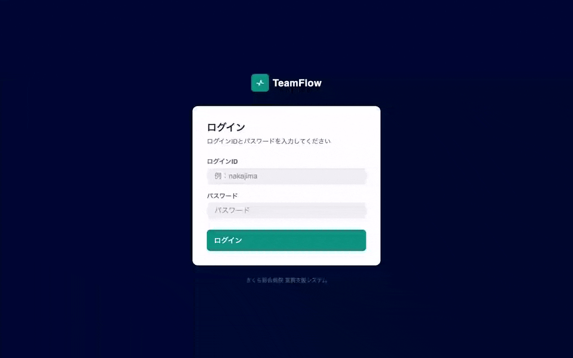
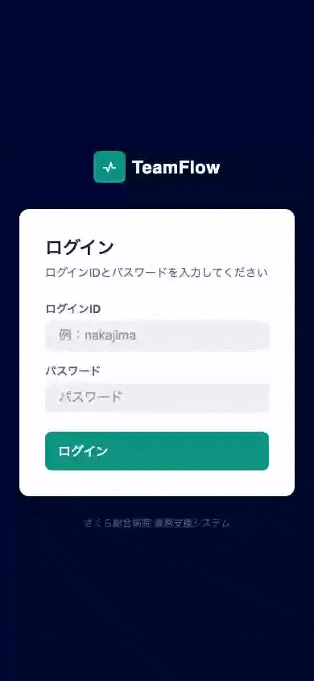
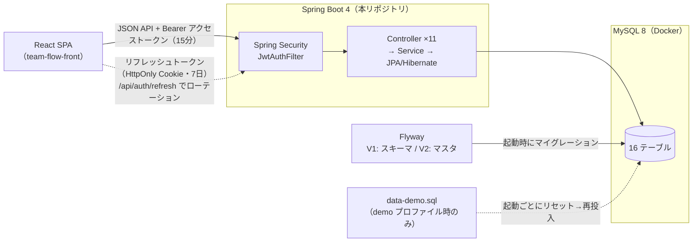
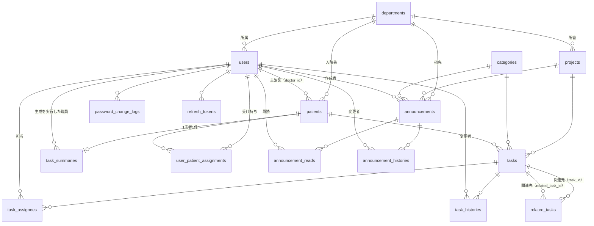

# TeamFlow

[](https://github.com/Miyuki-Hinata/team-flow/actions/workflows/ci.yml)
[](https://github.com/Miyuki-Hinata/team-flow-front/actions/workflows/ci.yml)

多職種が同時に動く病棟で、「誰が・どの患者に・何をするか」が口頭とメモに散っている問題を解決する、**チーム内タスク共有アプリ**です。
**前職で看護師として病棟に勤務した実体験**をもとに、医師・看護師・薬剤師・リハビリ職など 11 職種が担当・期限・進捗を**患者単位**で共有できるように設計しました。
Spring Boot 4 + React 19 / TypeScript の SPA。JWT + リフレッシュトークン認証、全テーブル共通の論理削除による監査証跡、Flyway によるスキーマ管理を個人開発で実装しています。

| | |
|---|---|
| バックエンド（本リポジトリ） | API / DB 設計 / 認証・認可。**プロジェクトの入口はこちら** |
| フロントエンド | [`team-flow-front`](https://github.com/Miyuki-Hinata/team-flow-front) |
| 全コンポーネントの設計意図 | [`docs/implementation/`（46 本）](https://github.com/Miyuki-Hinata/team-flow-front/tree/main/docs/implementation) |

---

## なぜ作ったか

病棟で一番時間を奪われていたのは医療行為ではなく、**情報の同期**でした。「あの患者さんの点滴指示、もう先生に確認の依頼しましたか？」を確認するために人を探す。申し送りまで状況が揃わない。誰かのメモにしか無い情報がある。

現場で「こういう仕組みがあれば」と思っていたことを、エンジニアへの転職を機に自分の手で形にしたのが TeamFlow です。

また、特定の職種に向けたアプリにはせず、**多くの職種で使える構成**にしました。現場での情報の滞りは同職種間だけでなく、職種と職種の**境界**でも多く発生していたため、職種は [`Role`](src/main/java/com/example/teamflow/enums/Role.java) として 11 種を列挙し、画面や権限を特定の職種に固定しない設計にしています。

| 現場で起きていること | TeamFlow での解決 |
|---|---|
| 情報が人に紐づき、申し送りまで同期されない | タスク・お知らせを DB に集約し、状態と履歴を常時参照 |
| 担当が曖昧で、二重実施と抜け落ちが起きる | 担当者の明示（複数可 / 全員宛）＋ `未対応 / 対応中 / 完了` の状態管理 |
| 「この患者に今日何が残っているか」を横串で見られない | 受け持ち患者の **24 時間タイムライン**で当日の残タスクを時系列表示 |
| 記録は消してはいけない（退職者の実施記録も監査対象） | 物理削除を使わない**論理削除**＋変更履歴テーブル |

---

## デモ

🌐 **公開デモ：https://teamflow.hinata-dev.com**（`nurse / admin1234`、管理者は `admin / admin1234`）
デモデータは毎日 4:00 に初期化されます。

**看護師の朝の業務フロー** — ログイン → ダッシュボード → 受け持ち患者の 24 時間タイムライン → タスクの状態変更（変更が履歴に記録される）：



機能ごとの短いデモ（クリックで展開）：

<details>
<summary><b>タスクの作成と編集</b> — 作成フォーム／編集での追記が変更履歴に「何から何に変えたか」で残る</summary>


</details>

<details>
<summary><b>受け持ち患者の選択とタイムライン</b> — 部署をまたいだ選択、タイムラインから患者詳細への遷移</summary>


</details>

<details>
<summary><b>管理者（看護師長）によるユーザー管理</b> — 追加と削除。自分自身の削除は無効化</summary>


</details>

<details>
<summary><b>ダークモードとログアウト</b> — テーマはトークンの差し替えで全画面が追従</summary>


</details>

<details>
<summary><b>モバイル表示</b> — 1 列レイアウトとオフキャンバスドロワー</summary>



</details>

パスワードはいずれも `admin1234`。一般ユーザーと管理者で、表示されるメニューと操作できる範囲が変わります。

| ログイン ID | 職種 / 権限 | ログイン後の状態 |
|---|---|---|
| `nurse` | 看護師（一般） | 受け持ち患者・本日のタスク・要対応患者が入っている。「管理」メニューは表示されない |
| `doctor` | 医師（一般） | 担当患者を持つ医師のアカウント |
| `admin` | 看護師長（管理者） | `/admin`（ユーザー・部署・カテゴリ・プロジェクトの管理）が使える。職種は看護師のまま管理者権限を持つ＝権限と職種を分離した設計の実例 |

デモデータはタスク期限を `CURDATE()` 相対で投入しているため、**起動した日がいつでも「本日のタスク」が入った状態**になります（[data-demo.sql](src/main/resources/data-demo.sql)）。

---

## 技術スタック

| 層 | 技術 |
|---|---|
| バックエンド | Java 21 / Spring Boot 4.0 / Spring Security / Spring Data JPA (Hibernate) / JJWT |
| DB | MySQL 8 / **Flyway**（スキーマ管理） |
| フロントエンド | React 19 / TypeScript / Vite / React Router 7 / styled-components |
| テスト | JUnit + MockMvc（バックエンド）/ Vitest + React Testing Library（フロントエンド） |
| CI | GitHub Actions（push ごとに lint / テスト / ビルドを検証。バックエンドは MySQL のサービスコンテナ上でテスト） |

### 技術選定の理由

選定の軸は、**転職を目指す業務システムの現場で実際に使われている技術で作る**ことです。そのうえで、それぞれの技術が何の要件に応えているかを記します。

**Java 21 / Spring Boot** — 11 職種 × 患者 × タスクと関係の多いドメインを、型と Controller / Service / Repository のレイヤ構造で堅く組むためです。医療・業務システムの現場で広く使われており、就職後にそのまま活きることも重視しました。バージョンは現役 LTS のうち、業界調査で本番利用の主流と確認した 21 を選択しています（当初 17 で開発し、テストを安全網に 21 へ更新）。

**MySQL 8** — このアプリのデータは多対多の関係と履歴・既読の記録が主役です。外部キー制約・一意制約で整合性を DB 側でも守れる、関係モデルが適切だと判断しました。

**Flyway** — 環境ごとにスキーマがずれて「自分の環境でだけ動かない」が起きるのを防ぐためです。スキーマ変更を git 管理された SQL マイグレーションに一本化し、どの環境でも起動時に同じ順番で適用されるようにしています。

**JWT + リフレッシュトークン** — SPA と REST API を分離したので、サーバーにセッションを持たないステートレスな認証が必要でした。JWT 単体の「発行後に取り消せない」弱点は、DB で失効管理するリフレッシュトークンで補っています。

**styled-components** — 色・余白・角丸をデザイントークンとして 1 箇所に定義し、全コンポーネントが型付きで参照する作り方をしたかったため、theme をコンポーネントへ直接配れる CSS-in-JS が適していると判断しました。テーマの差し替えでダークモードを実現しています。

**Context API（Redux は不採用）** — 現状、アプリ全体で共有する状態は認証・テーマ・トースト・未読件数の 4 つです。この規模に Redux のストア設計を持ち込むコストは見合わないと判断し、Context + props で管理しています。状態が増えて Context の連鎖が苦しくなった時点で再検討します。

---

## アーキテクチャ・設計のポイント

### 全体構成



### データモデル（リレーション）

テーブルは 16。中核は **users（職員）・patients（患者）・tasks（タスク）** の三角形で、履歴・既読・受け持ちなどの記録テーブルがそれを取り囲む構成です。列レベルの定義はここには載せず、[`V1__init.sql`](src/main/resources/db/migration/V1__init.sql) に一本化しています（理由は下記 4.）。カーディナリティは概略で、NULL 許容の外部キーも含みます。同じテーブルの組に関係が複数ある線だけ、区別のために列名を（）で添えています。



### 1. 監査証跡を前提にした論理削除

医療現場では「担当者が退職したら記録が消える」ことは許されません。全エンティティが継承する [`BaseEntity`](src/main/java/com/example/teamflow/entity/BaseEntity.java) に `deleted_at` / `updated_by` を持たせ、**物理削除をどこにも使っていません**。加えてタスク・お知らせは「いつ・誰が・どの項目を・何から何に変えたか」を履歴テーブル（`task_histories` / `announcement_histories`）に、パスワード変更も `password_change_logs` に記録します。

### 2. リフレッシュトークンはローテーション＋DB 失効管理

アクセストークン 15 分 / リフレッシュトークン 7 日（HttpOnly Cookie）。リフレッシュのたびにトークンを発行し直し、旧トークンは [`refresh_tokens`](src/main/java/com/example/teamflow/entity/RefreshToken.java) テーブルで失効させます。JWT に `typ` クレームを持たせ、**リフレッシュトークンを API 認証に流用できない**ようにし（[JwtUtil](src/main/java/com/example/teamflow/security/JwtUtil.java)）、論理削除済みユーザーの認証は [JwtAuthFilter](src/main/java/com/example/teamflow/security/JwtAuthFilter.java) で拒否します。

### 3. 権限は「職種」と分離し、API と UI で二重にガード

`users.level`（権限）と `Role`（職種）を分けています。職種はあくまで属性で、**職種から権限を導出しません**（現場では「看護師だが管理者」が普通に存在するため）。防御の本体は [`SecurityConfig`](src/main/java/com/example/teamflow/config/SecurityConfig.java) の `hasRole("ADMIN")` で、フロントの `AdminRoute`・メニュー出し分けは**体験のための二重ガード**です。認可の判定はサーバー側だけを信頼し、UI の出し分けには防御の役割を持たせていません。

### 4. スキーマの正解を Flyway に一本化

テーブル定義の唯一の正解は [`V1__init.sql`](src/main/resources/db/migration/V1__init.sql)（16 テーブル）です。Hibernate の自動 DDL は無効化し（`spring.jpa.hibernate.ddl-auto=none`）、エンティティの書き方ひとつで DB が暗黙に変わる経路を塞いでいます。手書きのスキーマ資料もあえて作りませんでした。Markdown に写した瞬間に「第 2 の正解」が生まれ、必ず古くなるからです。デモデータは Spring プロファイルで分離し（[application-demo.properties](src/main/resources/application-demo.properties)）、本番想定起動ではマスタのみ投入されます。

### 5. 設定ミスは起動時に落とす

`JWT_SECRET` に既定値を持たせず、未設定なら**起動に失敗**させます。DB 資格情報も [`RequiredConfigValidator`](src/main/java/com/example/teamflow/config/RequiredConfigValidator.java) で起動時に検証します。一方、接続先（ホスト・ポート）や CORS には安全側の既定値を置きました。**「気づかず動いてしまう」ことが危険な値は必須に、「動かないだけ」の値は既定値あり**、と設定漏れの危険の向きで分けています。

### 6. あえて作らなかったもの

作る判断と同じ粒度で、作らない判断も残します。

- **ユーザーの物理削除** — 職員のレコードを物理削除すると、タスク履歴・変更履歴から「誰が実施したか」が消えて記録が壊れます。削除は論理削除に統一し、代わりに認証を即時に無効化します（削除済みユーザーのトークンは次のリクエストから拒否）。
- **パスワードの再発行（セルフサービス）** — 「忘れた本人」を確認するにはメール等の到達手段が必要で、このアプリの本筋（業務ドメイン）から外れる基盤投資になります。現状は管理者がユーザー編集で再設定する運用にしています。実装する場合は、登録メールアドレス宛に有効期限付きのワンタイムトークンを載せた再設定リンクを送り、リンク先で新パスワードを設定する形を想定しています。トークンは既存のリフレッシュトークンと同様に、DB で有効期限と使用済みを管理して使い捨てにします。
- **Testcontainers** — テストは Docker Compose の MySQL をそのまま使い、CI でも MySQL のサービスコンテナで同じ構成を再現する方針です。テストごとにコンテナを立てる分離は、テスト同士の干渉が問題になった時点で再検討します。

---

## 開発の進め方と学び

### 設計判断を文書で残す

全コンポーネントについて「何を作ったか・**なぜこの設計にしたか**・何と一貫させたか」を [`docs/implementation/`（46 本）](https://github.com/Miyuki-Hinata/team-flow-front/tree/main/docs/implementation) に残しています。コミット本文にも判断理由を書く運用にしました（`git log` 参照）。

### 詰まった問題から学んだこと（抜粋）

- **`Access denied for user '${DB_USERNAME}'` の謎** — 「環境変数にすれば設定漏れは起動失敗になる」は思い込みでした。Spring の Binder は未解決のプレースホルダを**文字列のまま握りつぶして通す**ため、MySQL のエラーに化けます。さらに検証を `@PostConstruct` に書くと **Flyway の DB 接続の方が先に走る**ことも分かり、`BeanFactoryPostProcessor` での検証に落ち着きました。
- **CORS の矛盾はリクエスト時まで発覚しない** — `allowCredentials(true)` と `*` は併用できませんが、旧実装では起動が成功し、ブラウザから叩いて初めて（しかも 401 という無関係な症状で）壊れました。起動時に設定を組み立てて `validateAllowCredentials()` を明示的に呼ぶ形に直しました。
- **jjwt は鍵長で署名アルゴリズムが変わる** — 鍵を長くしたら HS256 が HS512 に**自動で**切り替わっていました。アルゴリズムを明示して固定しています。

### AI 支援について

実装には AI コーディング支援を全面的に使っています。一方で**設計判断（何を作るか・どの方式を選ぶか・何をやらないか）は自分で行い**、その根拠を `docs/implementation/` とコミット本文に残しています。上の「詰まった問題」はいずれも、AI の出力を実測で検証する過程で見つかったものです。

---

## セットアップ

Docker（Docker Desktop 等）があれば、`docker compose up` だけで全体（MySQL・API・フロントエンド）が起動します。

```bash
# 1) 2つのリポジトリを並べて clone（compose がフロントを ../team-flow-front から参照するため）
git clone https://github.com/Miyuki-Hinata/team-flow.git
git clone https://github.com/Miyuki-Hinata/team-flow-front.git

# 2) 環境変数を用意（.env の JWT_SECRET・DB_USERNAME・DB_PASSWORD・DB_ROOT_PASSWORD を設定。
#    値の決め方・生成コマンドは .env.example のコメント参照）
cd team-flow
cp .env.example .env

# 3) 起動（初回はイメージ取得とビルドで数分かかります。2回目以降は数十秒）
docker compose up -d

# 4) ブラウザで http://localhost:5173 を開く
#    ログイン：nurse / admin1234（管理者は admin / admin1234）
```

デモデータ（患者・タスク・お知らせ）は起動時に自動投入されます。
停止は `docker compose down`（DB データは保持）、データごと初期化は `docker compose down -v`。

<details>
<summary>Docker を使わず開発用に起動する場合</summary>

```bash
# MySQL だけコンテナで立て、アプリはホストで直接動かす（ホットリロードの効く開発スタイル）
cd team-flow
docker compose up -d db     # db サービスのみ起動
./mvnw spring-boot:run      # http://localhost:8080

cd ../team-flow-front
cp .env.example .env        # VITE_API_BASE_URL=http://localhost:8080
npm install
npm run dev                 # http://localhost:5173
```

</details>

---

## 今後の課題

現在も継続して開発しています（Issue はこのリポジトリに集約）。

- [#24](https://github.com/Miyuki-Hinata/team-flow/issues/24) タスク一覧のページネーションと N+1 クエリの点検
- [#26](https://github.com/Miyuki-Hinata/team-flow/issues/26) AI サマリの本実装 — 現状は `LlmService` インターフェースとモック実装まで。**LLM 接続は未実装**で、差し替えられる形にしてあります
- [#27](https://github.com/Miyuki-Hinata/team-flow/issues/27) E2E テスト（Playwright）
- [#25](https://github.com/Miyuki-Hinata/team-flow/issues/25) 公開デモ環境のデプロイ

---

<details>
<summary><b>機能・画面の一覧（クリックで展開）</b></summary>

### 機能

| 機能 | 内容 |
|---|---|
| 認証 | ログイン ID / パスワード。アクセストークン 15 分＋リフレッシュトークン 7 日（HttpOnly Cookie・ローテーション・DB 失効） |
| 認可 | 管理者のみ：マスタ管理・ユーザー管理・患者の登録／削除。API（Spring Security）と UI（AdminRoute）の二重ガード |
| タスク管理 | 患者 / プロジェクト / カテゴリ紐づけ、優先度・期限・状態、複数担当 |
| 変更履歴 | タスク・お知らせの項目単位の変更履歴（いつ・誰が・何から何に） |
| 患者管理 | 患者情報・担当医の紐づけ・患者単位のタスクカンバン |
| 受け持ち患者 | 自分の受け持ちを選択し、24 時間縦タイムライン（午前/午後/夜・7 日分切替・期限超過警告）で表示 |
| お知らせ | 部署 / カテゴリ / 優先度つき掲示、既読管理と未読バッジ |
| 管理画面 | ユーザー・部署・カテゴリ・プロジェクトの CRUD（タブ切替） |

### 画面

| 画面 | パス | 備考 |
|---|---|---|
| ログイン | `/login` | 未認証で唯一到達できる画面 |
| ダッシュボード | `/dashboard` | サマリカード×3＋未読お知らせ＋本日の要対応患者 |
| 受け持ち患者 | `/my-patients` | 一覧タブ／24 時間タイムラインタブ |
| 患者 | `/patients`, `/patients/:id`, `/patients/create` | 登録は**管理者のみ** |
| タスク | `/tasks`, `/tasks/my-tasks`, `/tasks/:id`, `/tasks/create` | 詳細で状態遷移と変更履歴 |
| お知らせ | `/announcements`, `/announcements/:id`, `/announcements/create` | 未読/既読タブ |
| 管理 | `/admin` | **管理者のみ** |

### 規模

| 項目 | 数 |
|---|---|
| テーブル | 16 |
| API コントローラ | 11 |
| 画面ルート | 16 |
| 共通 UI コンポーネント | 27 |
| 設計意図ドキュメント | 46 |
| テスト | バックエンド 22 件・フロントエンド 26 件（いずれも緑） |

</details>

---

Personal portfolio. No license granted for reuse.
